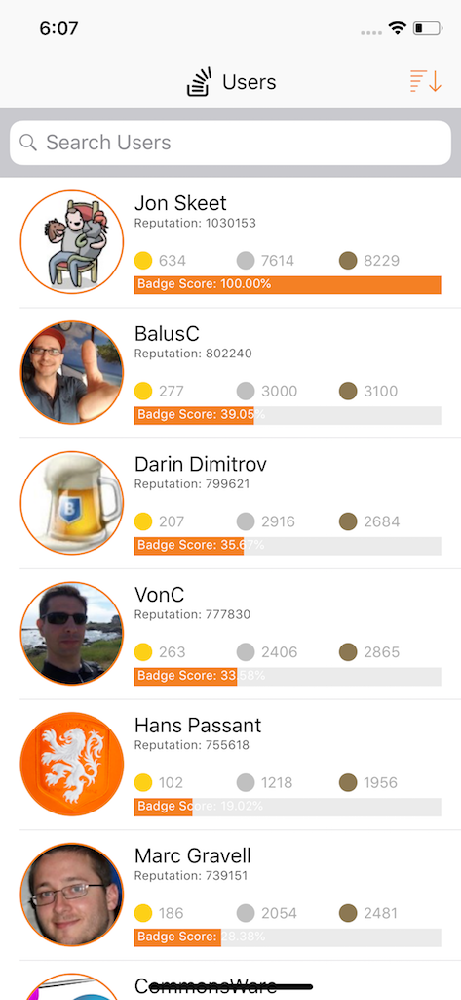

# Stackoverflow Users

## Project Targets
* StackoverflowUsers
* DataModelTests

## Functions

* Fetch first page of users from [Stackoverflow Users API Endpoint](https://api.stackexchange.com/2.2/users?site=stackoverflow&page=1&pagesize=30)
* Display users (gravatar, name, reputation, badges, and badge score) in TableView
* Show loading animation when downloading an image
* Cache images
* Search users by name
* Sort users by name, reputation, or badge score

## Design Pattern
* MVVM + Networking + Utils

## Tested Classes
* DMUser
* DMBadge

## App Structure Diagram

## Screenshots
### User List

### Search Users

### Sorting Options

### Sorted by score

